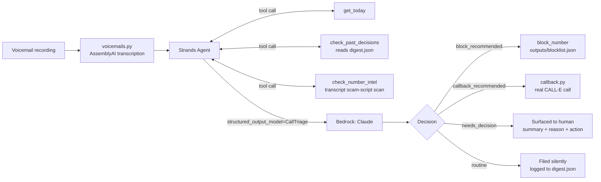

# Callismatic

An agent that listens to the voicemails you'd never otherwise check, decides
what actually needs you, and quietly handles or blocks the rest.

Built on the [Strands Agents SDK](https://strandsagents.com/) (Amazon Bedrock)
for the [Agents for Humans Hackathon](https://agentsforhumans.devpost.com/) —
**Professional Agents** track — with real integrations to
[AssemblyAI](https://www.assemblyai.com/) (voicemail transcription) and
[CALL-E](https://heycall-e.com/) (automatic callbacks), submitted separately
to their respective hackathons as well. See [docs/SUBMISSION.md](docs/SUBMISSION.md)
for the per-hackathon breakdown.

**Live deployment**: a dashboard + WhatsApp webhook + scoped JSON API
(`web.py`) is deployed to AWS Lambda at
https://awpfsufk4dofdncv6cgqsaifwy0kvolm.lambda-url.us-east-1.on.aws/ —
see [Deployment](#deployment) below for how, and what it does and doesn't
expose publicly.

## The problem

Scam and spam calls get bad enough that people and small businesses resort to
blocking all unknown numbers outright. That blocks the scam calls — but it
also blocks the client, the delivery driver, the interviewer, and the
doctor's office, because those are unknown numbers too until someone actually
listens. 80–90% of what gets silently blocked leaves a voicemail nobody ever
checks.

## What it does

Point it at a folder of voicemail recordings. For each one, it:

1. **Transcribes it** — real [AssemblyAI](https://www.assemblyai.com/) speech-to-text,
   not a canned transcript (`src/callismatic/voicemails.py`).
2. **Reasons about it** with tools available mid-thought: `get_today` (to judge
   how stale a callback request has become), `check_past_decisions` (so a
   caller already handled in a prior run isn't re-flagged), and
   `check_number_intel` — a transcript-content scam-script scan, **not** a
   Truecaller or carrier-database lookup (no public API for that exists; see
   [Why not Truecaller](#why-not-a-real-truecaller-integration) below).
3. **Decides** — via Strands' structured-output mode, forced into one schema
   (`src/callismatic/schema.py`): caller category (scam / spam / lead / important
   / routine), a plain-language summary, the concrete facts worth
   remembering, whether a human needs to decide anything, whether it's safe
   to auto-handle with a callback, and whether the number should be blocked.
4. **Acts** — deterministically, outside the model's own reasoning loop (the
   same pattern as logging the decision): blocks the number if it's a
   confirmed scam/spam, places a real callback via
   [CALL-E](https://heycall-e.com/) if the request is simple and automatable
   (`src/callismatic/callback.py`), or surfaces it to the human with full
   context if it genuinely needs a decision. Everything is logged to
   `outputs/digest.json`.

## Architecture



## Setup

```bash
pip install -e .
cp .env.example .env   # then edit BEDROCK_REGION / AWS_PROFILE / BEDROCK_MODEL_ID,
                        # ASSEMBLYAI_API_KEY, and CALLE_API_KEY as needed
```

This project calls Amazon Bedrock, AssemblyAI, and CALL-E, so it needs:
- AWS credentials resolvable by boto3 (`aws configure` or `aws login`, or an
  `AWS_PROFILE` set in `.env`) for the account you want billed, with model
  access enabled for an Anthropic Claude model in the Bedrock console, in the
  region set as `BEDROCK_REGION`.
- An [AssemblyAI](https://www.assemblyai.com/app/account) API key.
- A [CALL-E](https://dashboard.heycall-e.com/account/api-keys) API key (new
  accounts get 20 free calls).

## Running it

```bash
callismatic sample_voicemails
```

or, without installing the console script:

```bash
python -m callismatic.cli sample_voicemails
```

`sample_voicemails/` ships four synthetic voicemails, generated with an
offline TTS engine (`python demo/generate_samples.py` — no extra API key
needed for the *input* audio; the transcription step is still real
AssemblyAI): a gift-card scam script, a new business lead, a routine
appointment confirmation, and an important client matter — chosen to
exercise every branch: block, callback, needs-decision, and filed-silently.

Pass `--no-callbacks` to decide callbacks without actually placing them via
CALL-E, useful for a dry run that doesn't spend call quota.

## Tests

```bash
pytest
```

Tests cover the schema, the scam-script heuristic, the blocklist, and
transcription error-handling with a mocked AssemblyAI client — no live
AWS/AssemblyAI/CALL-E credentials needed to run them.

## Beyond the demo pipeline: opt-in extensions already built

Everything below is off by default -- unset credentials, unchanged behavior. Each is a real,
tested module, not a stub.

- **Correction feedback loop** (`corrections.py`, `check_corrections` tool) — `callismatic
  correct unblock <phone_number>` or `callismatic correct recategorize <file_name> --category
  ...` records a human override; the agent checks `check_corrections` before every decision
  and treats a match as ground truth, so a past misjudgment for that caller isn't repeated.
- **Carrier/community spam-signal layer** (`carrier_intel.py`, `check_carrier_intel` tool) — a
  second, independent signal (line type/carrier via Twilio Lookup) alongside the transcript
  heuristic, never replacing it. Needs `TWILIO_ACCOUNT_SID`/`TWILIO_AUTH_TOKEN`; absent, it
  reports "unavailable" and the transcript heuristic still works alone.
- **Emerging-markets call routing** (`call_router.py`) — a per-country provider registry
  (`PROVIDERS_BY_COUNTRY_CODE`) that `route_call` checks before falling back to CALL-E.
  CALL-E's own docs list many countries, India included, as "International" tier — routed
  through CALL-E's international numbers, which real testing in this project showed can get
  silently filtered by local carriers before the phone ever rings. This module is the
  extension point for a regional SIP/VoIP partner, not a partner integration itself — that
  needs an actual contract, which no code change can substitute for.
- **Multi-channel intake — WhatsApp receiver/sender code is live and verified; Meta's actual
  subscription is not** (`whatsapp_webhook.py`, built on `triage_text_message` in
  `triage.py`) — a real FastAPI receiver for the WhatsApp Business Cloud API: verifies Meta's
  webhook challenge, verifies every message's HMAC-SHA256 signature (`X-Hub-Signature-256`)
  before trusting it, parses incoming text messages, and triages each one through the exact
  same pipeline as a voicemail. Verified two ways directly: a real signed message posted
  straight to the deployed endpoint was correctly classified and blocked, and a real outbound
  WhatsApp message was sent and received on a verified test number via the Cloud API. What's
  **not** confirmed live is Meta automatically calling this webhook on every real incoming
  message — that needs Meta Business Verification (a separate identity/business document
  review process), out of scope for now; the webhook UI showed a saved state without that
  verification, which didn't correspond to an actual subscription (no request ever reached
  the deployed function in testing). Run with
  `uvicorn callismatic.whatsapp_webhook:app --port 8000`, then point a public HTTPS URL at it
  (a tunnel for testing, real hosting for production) and register that URL in the Meta App
  dashboard. Needs `WHATSAPP_APP_ID`/`WHATSAPP_APP_SECRET`/`WHATSAPP_VERIFY_TOKEN` to receive;
  `WHATSAPP_ACCESS_TOKEN`/`WHATSAPP_PHONE_NUMBER_ID` are only needed to send replies. SMS via
  Twilio would reuse the identical `triage_text_message` entry point — same pattern, different
  receiver, not yet built.
- **Google Sheets CRM sync** (`crm_sheets.py`) — appends every triaged result as a row,
  strictly opt-in and best-effort: a sync failure is logged, never raised, so a CRM outage
  can't break triage. Needs `GOOGLE_SERVICE_ACCOUNT_FILE` (a service account key) and
  `GOOGLE_SHEET_ID`, with the sheet shared to that service account's own email.
- **Weekly trust digest** (`digest_report.py`, `callismatic digest`) — since the whole design
  is the agent acting quietly on your behalf, this is the audit trail: "N blocked, N
  recommended for callback, N still need your decision" over the last N days. Delivery is
  `stdout`/`file` today (no credential needed); a WhatsApp/SMS/email channel is a small
  addition once one is chosen, not a redesign.
- **Concurrent sub-agent orchestration** (`triage_inbox_concurrent` in `triage.py`,
  `callismatic --concurrent`) — triages every voicemail at once instead of one at a time, each
  with its own freshly spawned `build_agent()` instance (Strands agents don't support safely
  reusing one instance across concurrent calls — `ConcurrentInvocationMode.THROW` is the
  default and raises `ConcurrencyException` on reentry — so a fresh sub-agent per task is the
  actual mechanism, not a metaphor). Bounded by `--max-concurrency` (default 5). Measured
  against the same 5 real sample voicemails, real AWS Nova + real AssemblyAI: **87.2s
  sequential vs. 18.7s concurrent, a 4.7x speedup** — an actual timed run, not a projection.
  Finding and fixing this surfaced a real bug: the digest/blocklist/to-do JSON files are
  read-modify-write, and two sub-agents finishing at the same instant could corrupt one —
  now guarded by a `threading.Lock` per file (`tools.py`, `todos.py`, `corrections.py`).
- **AI note-taker** (`meeting_notes.py`) — summarizes a completed CALL-E call's own
  `transcript_turns` into structured notes (summary, key points, action items, whether a human
  should review it) using the same Bedrock model already configured for triage — no new
  credentials, and no separate note-taking product, since a call transcript already flows
  through this pipeline. Deliberately raises rather than fabricates notes for a call with no
  real transcript (e.g. `NO_ANSWER`).
- **To-do list, with optional Todoist sync** (`todos.py`, `todoist_sync.py`,
  `callismatic todos`) — every `needs_decision=true` triage result already has a
  `suggested_action`; this makes that explicit, persisted, and completable instead of living
  only in one run's terminal output. Todoist sync is opt-in and best-effort via a plain
  personal API token (`TODOIST_API_TOKEN`) — unlike Google Tasks, Todoist has no OAuth
  requirement for your own account, which is why it was chosen over Tasks.
- **Google Calendar — availability + booking** (`calendar_sync.py`, `scheduling.py`) — reuses
  the exact same service account as Google Sheets (Calendar, like Sheets, supports sharing one
  specific resource with a service account's email; Google Tasks has no such sharing model,
  which is the same reason it was skipped above). `find_free_slots`/`book_meeting` read and
  write real calendar events; `scheduling.propose_slots_text` turns availability into the kind
  of natural-language offer a CALL-E `callback_task` can hand to a caller ("Tuesday Sep 15 at
  2:00 PM, Wednesday Sep 16 at 10:00 AM"), and `book_chosen_slot` turns whichever one the
  caller picks into a real event.
- **Reminders, delivered via WhatsApp** (`reminders.py`, `callismatic reminders`) — a local
  store of due-dated reminders; `callismatic reminders send` (meant to run periodically, like
  `digest`) delivers every reminder that's now due through the same WhatsApp send path already
  verified live (`whatsapp_webhook.send_whatsapp_message`), falling back to `stdout` if
  WhatsApp isn't configured or delivery fails, so a reminder is never silently lost.

## Why not a real Truecaller integration

Truecaller has no public developer API for reverse number lookup or call
blocking — it's a closed consumer product, not something a third-party
project can integrate with. `check_number_intel` does honest, real work
instead: it scans the transcript itself for concrete scam-script markers
(gift-card/wire/crypto payment requests, urgency or legal-threat pressure,
government-agency impersonation) as a heuristic signal for the agent to
weigh — never a fabricated "Truecaller lookup."

## What's out of scope for this pass

- No live phone line — voicemails come from a local folder, not a real
  inbound number. A real deployment would wire this to Twilio's recording
  webhooks; the caller number instead comes from the sample file's name
  (`caller_number_from_filename` in `src/callismatic/triage.py`).
- No folder-watching daemon — this is a batch run, not a background service.
- The scam-script check is a content heuristic, not a carrier-verified
  signal — see above.

## Deployment

`web.py` is the single deployable app, running live on AWS Lambda behind a public
Function URL: https://awpfsufk4dofdncv6cgqsaifwy0kvolm.lambda-url.us-east-1.on.aws/

- **Public, read-only**: `/` (dashboard), `/api/digest`, `/api/todos`, `/api/blocklist`.
- **Public, Meta's own auth**: `/webhook` (WhatsApp — verify-token challenge on GET, HMAC
  signature check on POST).
- **Auth-gated** (`X-API-Key` header): completing a to-do, adding/sending reminders,
  recording a correction, and `/api/triage/text` — which defaults to
  `place_callbacks=false` so a stray authenticated request still can't spend real CALL-E
  quota without an explicit opt-in.
- **Deliberately not exposed**: a public "upload a voicemail" endpoint — real, unfinished
  scope, not an oversight.

Secrets are in AWS Secrets Manager (`callismatic/prod`), not plaintext Lambda environment
variables — `lambda_handler.py` fetches them once at cold start into `os.environ`, so every
existing module keeps reading `os.environ` exactly as it already does. `paths.py` makes the
local JSON stores' directory overridable via `CALLISMATIC_DATA_DIR` (default `outputs`,
unchanged for local CLI use) since Lambda's deployment directory is read-only — `/tmp` is
the only writable path at runtime, which is where the Lambda handler points it.

To redeploy after a code change:

```bash
docker build --provenance=false --sbom=false -t callismatic:latest .   # Lambda rejects OCI attestation manifests
docker tag callismatic:latest 227214487086.dkr.ecr.us-east-1.amazonaws.com/callismatic:latest
docker push 227214487086.dkr.ecr.us-east-1.amazonaws.com/callismatic:latest
aws lambda update-function-code --function-name callismatic \
  --image-uri 227214487086.dkr.ecr.us-east-1.amazonaws.com/callismatic:latest --profile axxess-triaxis
```

## License

MIT — see [LICENSE](LICENSE).
