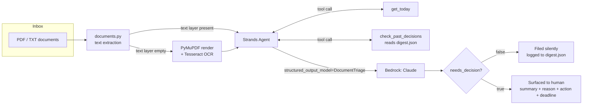

# Deskwork Agent

An agent that reads your inbox of invoices, contracts, forms, and correspondence,
and stays quiet unless one of them actually needs you to decide something.

Built for the [Agents for Humans Hackathon](https://agentsforhumans.devpost.com/) —
**Professional Agents** track — on the [Strands Agents SDK](https://strandsagents.com/).

## The problem

Solo consultants and small-business owners drown in low-stakes paperwork: receipts,
newsletters, "thanks, received" replies, alongside the small number of documents that
genuinely need a decision — an overdue invoice, a contract awaiting signature, a form
missing a required field with a deadline attached. Skimming all of it to find the few
that matter is the repetitive, judgment-heavy work this agent removes.

## What it does

Point it at a folder of documents. For each one, it:

1. **Reads it** — plain text or PDF, including PDFs with no extractable text layer
   (a real failure mode: a "Print to PDF" export can carry vector-drawn glyphs with no
   Unicode mapping at all — this project rasterizes and OCRs those rather than failing).
2. **Reasons about it** with two tools available mid-thought: `get_today` (so "due in 3
   weeks" vs. "overdue" is computed, not guessed) and `check_past_decisions` (so a vendor
   or invoice already handled in a prior run isn't re-flagged).
3. **Decides** — via Strands' structured-output mode, forced into one schema (see
   `src/deskwork/schema.py`): document type, a plain-language summary, the concrete facts
   worth remembering, and a `needs_decision` boolean.
4. **Surfaces only what needs it.** Everything is logged to `outputs/digest.json`, but
   the CLI report — and, in a real deployment, the interruption a busy person actually
   gets — is limited to the documents with `needs_decision: true`.

## Architecture



## Setup

```bash
pip install -e .
cp .env.example .env   # then edit BEDROCK_REGION / AWS_PROFILE / BEDROCK_MODEL_ID as needed
```

This project calls Amazon Bedrock, so it needs:
- AWS credentials resolvable by boto3 (`aws configure` or `aws login`, or an `AWS_PROFILE`
  set in `.env`) for the account you want billed.
- Model access enabled for an Anthropic Claude model in the Bedrock console, in the region
  set as `BEDROCK_REGION`.

On Windows, if `tesseract` isn't on PATH, set `TESSERACT_CMD` in `.env` to its install path.

## Running it

```bash
deskwork sample_inbox
```

or, without installing the console script:

```bash
python -m deskwork.cli sample_inbox
```

`sample_inbox/` ships five synthetic documents (an overdue invoice, a paid invoice, a
contract awaiting signature, an incomplete vendor form, and a newsletter) chosen to
exercise both branches: two need a decision, three should be filed silently.

## Tests

```bash
pytest
```

Tests cover document reading and schema validation only — no live model calls, so they
run without AWS credentials.

## What's out of scope for this pass

- No folder-watching daemon — this is a batch run, not a background service, though the
  agent loop is the same either way and wiring a watcher (e.g. `watchdog`) on top is a
  small addition, not a redesign.
- No email/drive ingestion — documents must already be in a local folder.
- OCR quality depends on Tesseract's output; a genuinely low-quality scan will produce a
  rougher transcription and the agent reasons over whatever text that yields.

## License

MIT — see [LICENSE](LICENSE).
