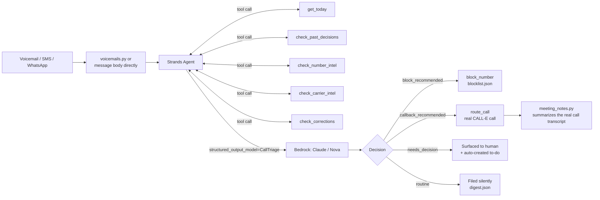
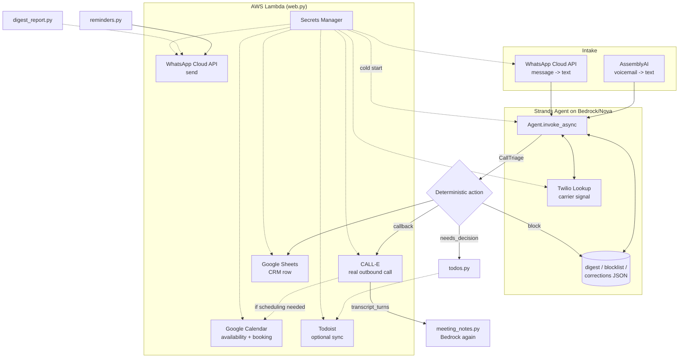

# Callismatic

**A personal secretary AI agent, with a phone operator built in.** It manages the parts of
your day a real assistant would — WhatsApp messages, your to-do list, calendar, CRM, and
meeting notes — and, as one of those functions, listens to the voicemails you'd never check,
deciding what needs you and quietly handling or blocking the rest.

Callismatic is the **individual** half of AXXESS TRIaxis's individual + enterprise product
configuration. **AXXESS TRIaxis**, built by **Triaxis Ventures Private Limited** (founded by
**Mr. Sudipta Koushik Sarmah** and **Ms. Ritashree Mahanta**), is an Enterprise SaaS and
Organizational OS platform on the enterprise side — governance, workspace, and org-wide
tooling for a company. Callismatic is the same underlying judgment (triage what needs a
person, quietly handle or block the rest) scoped down to one person's own calls, messages,
and to-dos, rather than an organization's. This repo is cloned and integrated into AXXESS
TRIaxis's public repository at
[github.com/axxess-triaxis/AXXESSTRIAXIS](https://github.com/axxess-triaxis/AXXESSTRIAXIS)
(`apps/callismatic`).

Built on the [Strands Agents SDK](https://strandsagents.com/) running on **Amazon Bedrock**
and **Amazon Nova**, for the [Agents for Humans Hackathon](https://agentsforhumans.devpost.com/)
— **Professional Agents** track — with real integrations across the rest of the stack: real
transcription via [AssemblyAI](https://www.assemblyai.com/), real outbound callbacks via
[CALL-E](https://heycall-e.com/), meeting notes, a synced Google Sheets CRM, Google Calendar
availability/booking, a Twilio-backed SMS/verify number, and a WhatsApp Business
receiver/sender — all on the same triage pipeline. It is also fully configurable as an
**Amazon Alexa+** tool source: the same app exposes a spec-compliant MCP server (see
[Beyond the demo pipeline](#beyond-the-demo-pipeline-opt-in-extensions-already-built) below)
that any MCP-speaking Alexa+ Agent Skill can be pointed at to reach Callismatic's live digest,
blocklist, to-dos, and triage tool.

Submitted or in progress across **7 hackathons** total, each targeting a different piece of
this same codebase rather than 7 separate builds — see
[docs/SUBMISSION.md](docs/SUBMISSION.md) for the per-hackathon breakdown:

| Hackathon | Status |
|---|---|
| Agents for Humans | **Submitted** (2026-09-14) |
| Call-E | **Submitted** (2026-09-14) |
| AssemblyAI Voice Agent Hackathon (lablab.ai) | Built, pending submission |
| AMD Developer Hackathon: ACT III (lablab.ai) | Built, pending submission — deadline Oct 18, 2026 |
| AMD Developer Hackathon (second track) | Pending submission |
| Nebius x NVIDIA Global AI Hackathon | Built and verified locally, pending submission |
| Build, Ship, Shape: Amazon Developer Hackathon (Alexa+) | Built and verified live on the deployed MCP server, pending submission |

A lightweight, credential-free demo of the triage output is also live on
[Hugging Face Spaces](https://huggingface.co/spaces/SKS1213/callismatic).

**Roadmap — AMD + Kubernetes**: a Kubernetes-orchestrated fine-tuning pipeline on AMD GPU
infrastructure is planned to train a proprietary, sandboxed model on Callismatic's own
accumulated triage decisions and human corrections — turning the "Personal Secretary & Phone
Manager" algorithm from a prompted agent into a purpose-trained, horizontally scalable one.
Design is written up in [docs/AMD_ACT3_ARCHITECTURE.md](docs/AMD_ACT3_ARCHITECTURE.md); as of
this writing no AMD compute has been provisioned and no training has run.

**Live deployment**: a two-column dashboard (KPI stats, category-colored triage cards, a
to-dos/blocked-numbers sidebar) + WhatsApp webhook + scoped JSON API + MCP server (`web.py`)
is deployed to AWS Lambda at
https://awpfsufk4dofdncv6cgqsaifwy0kvolm.lambda-url.us-east-1.on.aws/ — see
[Deployment](#deployment) below for how, and exactly what it does and doesn't expose
publicly.

---

## Problem statement

Scam and spam calls get bad enough that people and small businesses resort to blocking all
unknown numbers outright. That blocks the scam calls — but it also blocks the client, the
delivery driver, the interviewer, and the doctor's office, because those are unknown numbers
too until someone actually listens. 80–90% of what gets silently blocked leaves a voicemail
nobody ever checks.

The deeper problem isn't "how do we detect spam better" — plenty of tools do that. It's that
**blocking and listening are currently the same decision**: the only way to filter out noise
is to also filter out everything you haven't heard yet. Callismatic separates the two: every
call still reaches a voicemail, every voicemail gets listened to and understood, and *then* a
decision gets made — block, handle it automatically, or put it in front of a human — instead
of a human having to choose blanket silence over constant interruption.

## What Callismatic is

Callismatic is framed deliberately as **a secretary, not a filter** — the audience is a solo
consultant, freelancer, or small-business owner who doesn't have staff to screen calls,
manage messages, or handle the follow-up work either one generates. That's two related but
distinct jobs a human assistant would do — Callismatic is the personal secretary first, with
phone operation as one of the functions it performs, not the whole identity:

**As a personal secretary**, it turns what happens across your calls and messages into the
things a real assistant would hand you afterward: structured notes from a completed callback,
a to-do list built from what actually needs your attention, calendar availability and booking
for anything that needs scheduling, a synced CRM row for every real contact, and reminders
delivered back to you on WhatsApp — instead of any of that living only in a terminal's
scrollback from whichever run produced it.

**As a phone operator**, it listens to every voicemail (or incoming SMS/WhatsApp message),
decides what kind of caller it is, and acts on that decision without waiting to be asked:
blocks confirmed scam/spam numbers, places a real callback for anything simple enough to
handle without a human's judgment, or surfaces genuinely important calls with full context.

## Use cases

- **Solo consultants and freelancers** (the primary Professional Agents audience) — the
  person who currently blocks all unknown numbers because they can't afford to have a bad
  scam call derail their focus, and misses real client inquiries as the cost of that.
- **A small front desk** — a dental office or similar business confirming appointments and
  handling missed-delivery notices without anyone needing to personally return every call.
- **New-lead intake** for contractors, agents, or anyone whose business runs on inbound
  interest — a kitchen-remodel inquiry gets an automatic callback offering real calendar
  availability, not a voicemail that sits for three days.
- **Solo medical/legal/professional practices** — call volume is high, but only a small
  fraction is genuinely urgent; the rest is routine, administrative, or noise.
- **Individuals on a personal number** in a region with heavy scam-call volume, who want the
  same screen-and-handle treatment a business would build for its main line.

## Benefits

The core benefit is recovering calls that blanket-blocking currently destroys, without
reintroducing the interruption blocking was meant to prevent. Two honest categories:

- **Measured in this project**: the concurrency work shows the mechanical benefit directly —
  87.2s sequential vs. 18.7s concurrent to triage the same 5 real voicemails (4.7x), meaning
  a backlog of missed calls gets caught up quickly rather than trickling in one at a time.
- **Illustrative, not measured**: no real deployment has run long enough to produce an actual
  recovered-lead or time-saved number yet — an honest back-of-envelope, not a claim: if a
  blocked-everything user currently gets even 15–20 scam calls a day and spends 20–30 seconds
  noticing and dismissing each one, that's roughly 5–10 minutes a day, on top of whatever real
  calls got silently lost entirely. The real value is concentrated in the second number, which
  by definition isn't visible to someone doing this manually — it's exactly the class of loss
  Callismatic exists to surface.

## Commercial viability

This is a prototype, not a business with customers or revenue yet — the case below is a
reasoned argument from cost structure and market comparison, not a claim of traction.

- **The market gap**: a solo professional or small business faces the same call-volume
  problem a call center solves for enterprises, but can't afford a human receptionist —
  staffed virtual-receptionist services (e.g. Ruby Receptionists, Smith.ai) typically run
  $200–500+/month because a human is answering every call. Consumer call-blocking apps
  (Truecaller, Robokiller) solve the opposite half of the problem cheaply — they block, but
  they don't triage, callback, or schedule anything.
- **Development cost of this prototype was effectively $0** — built without paid engineering
  time, and every external service used during development ran on a free tier, trial credit,
  or sign-up allowance: AssemblyAI's free account, CALL-E's 20 free calls, Twilio's trial
  credits, Google Cloud's free tier (Sheets/Calendar APIs), WhatsApp Cloud API's free test-number
  tier, Todoist's free personal API, and AWS credits for Bedrock/Lambda. This is specifically a
  build-cost claim, not an operating-cost one — running this for real, paying users still means
  real, metered per-usage cost, described next.
- **Cost structure**: every real cost here is usage-metered (AssemblyAI per-minute, CALL-E
  per-call, Bedrock/Nova per-token, Twilio Lookup per-lookup) — a classic consumption-based
  COGS profile that maps cleanly onto a usage-bounded subscription tier (a fixed number of
  voicemails/callbacks per month, priced well under a staffed alternative because there's no
  human labor cost scaling with call volume).
- **A real moat, not just a feature**: the correction feedback loop (`corrections.json`)
  is, as a side effect, exactly the labeled data a proprietary fine-tune needs — see
  [`docs/AMD_ACT3_ARCHITECTURE.md`](docs/AMD_ACT3_ARCHITECTURE.md). Over real usage, that
  accumulates into training data no generic call-screening competitor has, and could
  eventually lower per-decision inference cost (a small fine-tuned model vs. a frontier model
  call every time) — a genuine unit-economics argument, not just a technical curiosity.

## Risks and failure modes

Being direct about where this can go wrong, not just where it works:

- **False positives (blocking a real caller)** — the transcript heuristic and carrier signal
  are evidence, not proof; a legitimate caller using urgent language, or a real business on a
  VOIP line, could get misclassified. Mitigated by the correction feedback loop
  (`callismatic correct unblock`), but that's a recovery mechanism, not prevention — a
  wrongly blocked caller is still blocked until a human notices and corrects it.
- **False negatives (a real scam gets through)** — scam scripts evolve; a scammer who avoids
  the specific markers `check_number_intel` looks for won't be caught by it. This is
  explicitly a heuristic signal to weigh, never a guarantee — see
  [Why not Truecaller](#why-not-a-real-truecaller-integration).
- **Inappropriate auto-callback** — the riskier failure mode isn't missing a scam, it's the
  agent judging something "simple enough to automate" when it actually needed a human's
  judgment, and CALL-E then conducting a real conversation on incomplete or wrong authority.
  `callback_recommended` and `needs_decision` are independent for exactly this reason, but
  the boundary is still a model judgment call, not a hard rule.
- **Upstream error propagation** — a transcription mistake (a misheard name, amount, or
  number) or an LLM misreading of the transcript both feed directly into the classification;
  structured output constrains the *shape* of the answer, not its accuracy.
- **Cost/abuse exposure** — Bedrock, AssemblyAI, and CALL-E are all metered; an unauthenticated
  or flooded trigger path could run up real cost. This is why the deployed API gates every
  mutating/triggering route behind `X-API-Key` and defaults `/api/triage/text` to
  `place_callbacks=false` — see [Deployment](#deployment) — but a leaked key or a bug in that
  gate is still a real exposure, not a theoretical one.
- **Privacy** — voicemail transcripts and call transcripts contain real names, numbers, and
  sometimes sensitive personal context. Nothing in this codebase currently redacts PII before
  it's written to `digest.json`/`corrections.json` or synced to Google Sheets — the AMD
  training-architecture doc calls this out as a mandatory step for any centralized training
  pipeline, and the same discipline applies to any real multi-user deployment, not just
  training.
- **Regulatory exposure for the callback itself** — an agent placing outbound calls
  automatically is the kind of activity telemarketing/robocall regulation (e.g. the US TCPA)
  cares about. The intended use — calling back someone who already called and left a
  voicemail — is a materially different consent posture than cold outbound, but this project
  makes no legal claim about compliance in any specific jurisdiction; that's a real
  consideration for anyone deploying this beyond a demo, not something solved by this
  codebase.
- **Third-party dependency risk** — six external services (Bedrock, AssemblyAI, CALL-E,
  Twilio, Google, Meta, Todoist) each have their own uptime, pricing, and policy risk. Some
  paths degrade gracefully (CRM sync, Todoist sync, and carrier intel are all best-effort and
  never block triage on failure); others don't — if AssemblyAI is down, voicemail
  transcription simply fails for that item, with no fallback STT provider.
- **Ironic re-creation of the original problem** — an overly aggressive block threshold would
  reproduce exactly the failure mode this project exists to fix. `block_recommended` requires
  concrete transcript evidence by design, specifically to keep this risk asymmetric in the
  safer direction (missing a block is recoverable via a correction; the goal is to never be
  the reason a real caller gets silently dropped again).

## How it works

Point it at a folder of voicemail recordings (or feed it a live SMS/WhatsApp message). For
each one, it:

1. **Transcribes it** — real [AssemblyAI](https://www.assemblyai.com/) speech-to-text, not a
   canned transcript (`voicemails.py`). A text message needs no transcription step — the
   message body already is the text to reason over (`triage_text_message` in `triage.py`).
2. **Reasons about it** with tools available mid-thought: `get_today` (to judge staleness),
   `check_past_decisions` (so a caller already handled isn't re-flagged),
   `check_number_intel` (a transcript-content scam-script scan — deliberately not a
   Truecaller-style lookup, since no public API for that exists; see
   [Why not Truecaller](#why-not-a-real-truecaller-integration)), `check_carrier_intel` (a
   second, independent carrier/line-type signal via Twilio Lookup), and `check_corrections`
   (a human override always wins over the agent's own judgment for that caller).
3. **Decides** — via Strands' structured-output mode, forced into one schema (`CallTriage`,
   detailed below): caller category, a plain-language summary, the concrete facts worth
   remembering, whether a human needs to decide anything, whether it's safe to auto-handle
   with a callback, and whether the number should be blocked.
4. **Acts** — deterministically, outside the model's own reasoning loop (the same pattern as
   logging the decision): blocks confirmed scam/spam, places a real callback via
   [CALL-E](https://heycall-e.com/) for simple/automatable requests, or surfaces genuinely
   important calls to the human with full context. Every decision with `needs_decision=true`
   also becomes a real to-do item automatically.



## Data schema

### `CallTriage` — the one shape every triage decision is forced into

Defined in [`schema.py`](src/callismatic/schema.py) as a Pydantic model; Strands enforces it
as the model's structured output, so the rest of the pipeline never re-interprets prose — it
checks booleans.

| Field | Type | Meaning |
|---|---|---|
| `category` | `"scam" \| "spam" \| "lead" \| "important" \| "routine"` | What kind of caller this is |
| `summary` | `str` | One or two sentence plain-language summary |
| `key_facts` | `dict[str, str]` | Concrete facts actually present in the transcript — name, company, amount, etc. |
| `needs_decision` | `bool` | True only if a human must personally decide or respond |
| `decision_reason` | `str \| None` | If `needs_decision`, the one-sentence reason |
| `suggested_action` | `str \| None` | If `needs_decision`, the concrete next step — this becomes a to-do automatically |
| `callback_recommended` | `bool` | True only if safe to auto-handle without a human's judgment |
| `callback_task` | `str \| None` | If `callback_recommended`, the exact instruction handed to CALL-E |
| `block_recommended` | `bool` | True only on concrete scam/spam evidence, never vague suspicion |
| `urgency` | `"none" \| "low" \| "medium" \| "high"` | How time-sensitive; `"none"` unless `needs_decision` |

`needs_decision` and `callback_recommended` are intentionally independent — a call can need a
human *and* get a courtesy callback (an important client who also gets an appointment
confirmed), or need a human with no callback at all (a job interview never gets an autonomous
callback on someone's behalf).

### `MeetingNotes` — what a completed callback becomes

Defined in [`meeting_notes.py`](src/callismatic/meeting_notes.py), built from a real CALL-E
call's own `transcript_turns` (not simulated) via the same Bedrock model as triage.

| Field | Type | Meaning |
|---|---|---|
| `summary` | `str` | One or two sentences on what actually happened |
| `key_points` | `list[str]` | Concrete facts discussed — names, dates, amounts, decisions |
| `action_items` | `list[str]` | Concrete next steps that came out of the call |
| `follow_up_needed` | `bool` | True if a human should review this call before considering it closed |

`summarize_call` raises `ValueError` rather than fabricating notes for a call with no real
transcript (e.g. `NO_ANSWER`) — there is nothing to honestly summarize from a call that never
connected.

### Persisted store shapes

Everything below lives as append-only JSON under `outputs/` locally (`CALLISMATIC_DATA_DIR`
in a deployed environment — see [Deployment](#deployment)), one array of objects per file.

**`digest.json`** — every triage decision (`tools.record_decision`):
```json
{"file": "scam_gift_card_+15550001111.wav", "triaged_at": "2026-09-13T07:51:40Z", "triage": { /* CallTriage, in full */ }}
```

**`blocklist.json`** — every blocked number (`tools.block_number`):
```json
{"phone_number": "+15550001111", "reason": "Gift-card scam script detected.", "blocked_at": "2026-09-13T07:51:42Z"}
```

**`todos.json`** — every to-do item (`todos.add_todo`):
```json
{"id": "todo-1", "text": "Call Daniel Ortiz back to discuss kitchen remodel options.", "source": "new_lead_kitchen_remodel.wav", "due": null, "done": false, "created_at": "2026-09-13T07:51:10Z", "completed_at": null}
```

**`reminders.json`** — every scheduled reminder (`reminders.add_reminder`):
```json
{"id": "reminder-1", "text": "Follow up with Daniel Ortiz.", "due_at": "2026-09-20T00:00:00Z", "to": "+15550001111", "sent": false, "created_at": "2026-09-13T08:00:00Z"}
```

**`corrections.json`** — every human override (`corrections.record_correction`):
```json
{"target": "+15550001111", "original": {"block_recommended": true}, "corrected": {"block_recommended": false}, "reason": "Verified: real bank, not a scam.", "corrected_at": "2026-09-13T07:02:58Z"}
```

Every write to `digest.json`/`blocklist.json`/`todos.json`/`corrections.json` is guarded by a
`threading.Lock` per file (`tools.py`, `todos.py`, `corrections.py`) — found necessary by a
real, reproducible bug: `triage_inbox_concurrent` running multiple sub-agents on separate
worker threads could have two of them read-modify-write the same file at the same instant and
corrupt it. Confirmed by a test that intermittently failed with `JSONDecodeError` before the
locks were added, and passed cleanly across five repeated runs after.

## Tech stack

**Agent orchestration** — [Strands Agents SDK](https://strandsagents.com/): the tool-calling
event loop, structured-output enforcement (`CallTriage`, `MeetingNotes`), and — for the
concurrent triage path — native async invocation (`invoke_async`) and the fact that Strands
agents don't support safe concurrent reuse of one instance
(`ConcurrentInvocationMode.THROW` raises `ConcurrencyException` on reentry), which is *why*
`triage_inbox_concurrent` spawns one fresh `build_agent()` per voicemail rather than sharing
one.

**Model provider** — Amazon Bedrock, via `boto3`. Claude is the intended model
(`global.anthropic.claude-sonnet-4-6`); Amazon Nova (`amazon.nova-pro-v1:0`) is the current
fallback, since Claude on Bedrock needs both an Anthropic use-case form *and* a valid AWS
Marketplace payment method, and this account currently fails
`AccessDeniedException: INVALID_PAYMENT_INSTRUMENT` on the latter. Bedrock is also the
always-on safety net for a second, opt-in provider: Nebius Token Factory (OpenAI-compatible,
`strands.models.openai.OpenAIModel`), routed via a Strands `ModelRouter`/`FallbackStrategy` —
see the Nebius bullet under [Beyond the demo
pipeline](#beyond-the-demo-pipeline-opt-in-extensions-already-built).

**Voice & telephony** — [AssemblyAI](https://www.assemblyai.com/) for real speech-to-text on
voicemail recordings; [CALL-E](https://heycall-e.com/) (`calle-ai` SDK) for placing real,
autonomous outbound calls from a natural-language task; [Twilio](https://www.twilio.com/)
Lookup for a second, independent carrier/line-type signal (`carrier_intel.py`).

**Messaging** — the WhatsApp Business Cloud API (`whatsapp_webhook.py`, a FastAPI receiver
with HMAC-SHA256 signature verification) for both incoming message intake and outgoing
replies/reminders, via `httpx`.

**Productivity integrations** — Google Sheets (`crm_sheets.py`) and Google Calendar
(`calendar_sync.py`, `scheduling.py`) via `google-api-python-client` and a shared service
account (Calendar and Sheets both support sharing one specific resource with a service
account's email, which is why they were chosen over Google Tasks — Tasks has no equivalent
sharing model and would need a full OAuth consent flow); [Todoist](https://todoist.com/) via
its plain personal-API-token REST API (`todoist_sync.py`), chosen over Google Tasks for the
same reason.

**Web/API layer** — [FastAPI](https://fastapi.tiangolo.com/) (`web.py`): a server-rendered,
two-column HTML dashboard (hand-rolled CSS, no client-side framework or build step), a
read-only JSON API, an `X-API-Key`-gated mutating API, the WhatsApp webhook, and an MCP server
(`mcp_server.py`, Streamable HTTP, for Alexa+ and other MCP-speaking clients) — all in one app,
one Lambda deployment.

**Data validation** — [Pydantic](https://docs.pydantic.dev/) for every structured shape
(`CallTriage`, `MeetingNotes`, and the FastAPI request/response models in `web.py`).

**Infrastructure & deployment** — Docker (a container image built on
`public.ecr.aws/lambda/python:3.12`), Amazon ECR, AWS Lambda (container image, a public
Function URL), AWS Secrets Manager (`callismatic/prod` — fetched once at cold start into
`os.environ`, never as plaintext Lambda environment variables), and `mangum` as the
ASGI-to-Lambda adapter.

**Testing** — `pytest`, with every external service (Bedrock, AssemblyAI, CALL-E, Twilio,
Google, Todoist, WhatsApp) mocked at the boundary so the suite (95 tests) runs with no live
credentials.

**Language/runtime** — Python 3.11+, `asyncio` for the concurrent triage path,
`python-dotenv` for local `.env` loading.

## How the stack fits together

The pieces above aren't independent integrations bolted on side by side — each sits at a
specific point in one real pipeline, and several feed each other directly:



A few interactions worth calling out explicitly, since they're not obvious from a service
list alone:

- **AssemblyAI and WhatsApp are alternative front doors to the same agent.** Both terminate
  as plain text handed to `_decide_and_act`/`_decide_and_act_async` in `triage.py` — the agent
  never knows or cares which channel a message arrived from, which is why adding SMS later is
  "a new receiver," not new agent logic.
- **CALL-E's output becomes Bedrock's input a second time.** `meeting_notes.py` doesn't call a
  different summarization service — it hands CALL-E's own `transcript_turns` back to the same
  Bedrock model that did the original triage, via a second, separate Strands `Agent` instance.
  One model provider, two different structured-output jobs (`CallTriage`, then `MeetingNotes`).
- **Google Calendar and CALL-E compose through plain text, not an API call between them.**
  `scheduling.propose_slots_text` turns real Calendar availability into a natural-language
  string; that string becomes part of the `callback_task` CALL-E receives. CALL-E has no
  Calendar integration of its own — the composition happens entirely on Callismatic's side,
  before the call is ever placed.
- **WhatsApp is bidirectional through one credential set, two different code paths.**
  `WHATSAPP_ACCESS_TOKEN`/`WHATSAPP_PHONE_NUMBER_ID` are used both by the webhook receiver
  (implicitly, since Meta needs them configured to deliver messages) and by
  `send_whatsapp_message`, which `reminders.py` and (optionally) `digest_report.py` both call
  — the same function is the exit path for two otherwise-unrelated features.
- **Todoist and Google Sheets are both "best-effort shadows" of state that already exists
  locally.** Neither is a source of truth — `todos.json` and `digest.json` are — so a sync
  failure to either is logged and swallowed (`_sync_to_todoist_if_configured`,
  `_sync_to_crm_if_configured`) rather than propagated, by the same design decision applied
  twice.
- **AWS Secrets Manager is the actual integration point for every other service in
  production.** None of the seven other services' credentials are hardcoded or passed at
  deploy time as plaintext — `lambda_handler.py` is the one place that knows how to reach
  Secrets Manager, and every other module is unaware anything changed, since they all just
  read `os.environ` the same way they do locally from `.env`.
- **Concurrency intersects the persistence layer, not the reasoning layer.** Running
  `--concurrent` doesn't change how any single voicemail is reasoned about — each still gets
  its own full Strands turn — it changes how many of those turns run at once, which is why
  the real bug it surfaced (see [Data schema](#data-schema)) was in the shared JSON stores,
  not in the agent logic itself.

## Setup

```bash
pip install -e .
cp .env.example .env   # then edit BEDROCK_REGION / AWS_PROFILE / BEDROCK_MODEL_ID,
                        # ASSEMBLYAI_API_KEY, and CALLE_API_KEY as needed
```

This project calls Amazon Bedrock, AssemblyAI, and CALL-E, so it needs:
- AWS credentials resolvable by boto3 (`aws configure` or `aws login`, or an `AWS_PROFILE`
  set in `.env`) for the account you want billed, with model access enabled for a Bedrock
  model in the region set as `BEDROCK_REGION`.
- An [AssemblyAI](https://www.assemblyai.com/app/account) API key.
- A [CALL-E](https://dashboard.heycall-e.com/account/api-keys) API key (new accounts get 20
  free calls).

Everything else — Twilio, Google Sheets/Calendar, WhatsApp, Todoist — is optional; see
`.env.example` for exactly what each needs and what happens when it's unset.

## Running it

```bash
callismatic sample_voicemails                 # sequential, one sub-agent call at a time
callismatic sample_voicemails --concurrent     # one fresh sub-agent per voicemail, run at once
callismatic sample_voicemails --no-callbacks   # decide callbacks without placing them via CALL-E
callismatic correct unblock <phone_number>     # record a human override
callismatic digest                             # print what's happened recently
callismatic todos                              # list open to-dos
callismatic reminders add "..." --due <iso> --to <number>
```

`sample_voicemails/` ships five synthetic voicemails, generated with an offline TTS engine
(`python demo/generate_samples.py` — no extra API key needed for the *input* audio; the
transcription step is still real AssemblyAI): a gift-card scam script, a new business lead, a
routine appointment confirmation, a missed-package-delivery notice, and an important client
matter — chosen to exercise every branch: block, callback, needs-decision, and
filed-silently.

Measured on this exact set, real AWS Nova + real AssemblyAI: **87.2s sequential vs. 18.7s
concurrent — a 4.7x speedup**, an actual timed run in both directions, not a projected
number.

## Tests

```bash
pytest
```

95 tests, covering the schema, the scam-script and carrier-intel heuristics, the blocklist,
the concurrency locking, the model-routing fallback logic, and every external integration
against a mocked client — no live AWS/AssemblyAI/CALL-E/Twilio/Google/Todoist/WhatsApp
credentials needed to run them.

## Beyond the demo pipeline: opt-in extensions already built

Everything below is off by default — unset credentials, unchanged behavior. Each is a real,
tested module, not a stub.

- **Correction feedback loop** (`corrections.py`, `check_corrections` tool) — `callismatic
  correct unblock <phone_number>` or `callismatic correct recategorize <file_name> --category
  ...` records a human override; the agent checks `check_corrections` before every decision
  and treats a match as ground truth, so a past misjudgment for that caller isn't repeated.
- **Carrier/community spam-signal layer** (`carrier_intel.py`, `check_carrier_intel` tool) — a
  second, independent signal (line type/carrier via Twilio Lookup) alongside the transcript
  heuristic, never replacing it. Needs `TWILIO_ACCOUNT_SID`/`TWILIO_AUTH_TOKEN`; wired and
  verified against a real account, currently blocked by that account's own trial-tier Lookup
  quota (error 60627) — a Twilio account-level limit, not a bug in the integration.
- **Emerging-markets call routing** (`call_router.py`) — a per-country provider registry
  (`PROVIDERS_BY_COUNTRY_CODE`) that `route_call` checks before falling back to CALL-E.
  CALL-E's own docs list many countries, India included, as "International" tier — routed
  through CALL-E's international numbers, which real testing in this project showed can get
  silently filtered by local carriers before the phone ever rings (a real call, confirmed
  dialed by a provider-issued call ID, never rang). This module is the extension point for a
  regional SIP/VoIP partner, not a partner integration itself — that needs an actual
  contract, which no code change can substitute for.
- **Multi-channel intake — WhatsApp receiver/sender code is live and verified; Meta's actual
  subscription is not** (`whatsapp_webhook.py`, built on `triage_text_message` in
  `triage.py`) — a real FastAPI receiver for the WhatsApp Business Cloud API: verifies Meta's
  webhook challenge, verifies every message's HMAC-SHA256 signature (`X-Hub-Signature-256`)
  before trusting it, parses incoming text messages, and triages each one through the exact
  same pipeline as a voicemail. Verified two ways directly: a real signed message posted
  straight to the deployed endpoint was correctly classified and blocked, and a real outbound
  WhatsApp message was sent and received on a verified test number via the Cloud API. What's
  **not** confirmed live is Meta automatically calling this webhook on every real incoming
  message — that needs Meta Business Verification (a separate identity/business document
  review process), out of scope for now.
- **Google Sheets CRM sync** (`crm_sheets.py`) — appends every triaged result as a row,
  strictly opt-in and best-effort: a sync failure is logged, never raised, so a CRM outage
  can't break triage. Needs `GOOGLE_SERVICE_ACCOUNT_FILE` (a service account key) and
  `GOOGLE_SHEET_ID`, with the sheet shared to that service account's own email. Verified
  against a real spreadsheet: rows appended and read back correctly.
- **Weekly trust digest** (`digest_report.py`, `callismatic digest`) — since the whole design
  is the agent acting quietly on your behalf, this is the audit trail: "N blocked, N
  recommended for callback, N still need your decision" over the last N days. Delivery is
  `stdout`/`file` today (no credential needed); WhatsApp is available as a channel once
  configured, same delivery path reminders use.
- **Concurrent sub-agent orchestration** (`triage_inbox_concurrent` in `triage.py`,
  `callismatic --concurrent`) — see [How it works](#how-it-works) and
  [Data schema](#data-schema) above for the mechanism and the real bug it surfaced.
- **AI note-taker** (`meeting_notes.py`) — see [Data schema](#data-schema) above.
- **To-do list, with optional Todoist sync** (`todos.py`, `todoist_sync.py`,
  `callismatic todos`) — every `needs_decision=true` triage result already has a
  `suggested_action`; this makes that explicit, persisted, and completable instead of living
  only in one run's terminal output. Todoist sync is opt-in and best-effort via a plain
  personal API token (`TODOIST_API_TOKEN`).
- **Google Calendar — availability + booking** (`calendar_sync.py`, `scheduling.py`) — reuses
  the exact same service account as Google Sheets. `find_free_slots`/`book_meeting` read and
  write real calendar events (verified: a real event booked, read back, then cleaned up);
  `scheduling.propose_slots_text` turns availability into the kind of natural-language offer
  a CALL-E `callback_task` can hand to a caller ("Tuesday Sep 15 at 2:00 PM, Wednesday Sep 16
  at 10:00 AM"), and `book_chosen_slot` turns whichever one the caller picks into a real
  event.
- **Reminders, delivered via WhatsApp** (`reminders.py`, `callismatic reminders`) — a local
  store of due-dated reminders; `callismatic reminders send` (meant to run periodically, like
  `digest`) delivers every reminder that's now due through the same WhatsApp send path,
  falling back to `stdout` if WhatsApp isn't configured or delivery fails, so a reminder is
  never silently lost. Verified: a real reminder sent and received on a verified test number.
- **MCP server, for Alexa+ and any other MCP-speaking client** (`mcp_server.py`) — the same
  read-only tool set as the JSON API (`get_weekly_digest`, `list_blocked_numbers`,
  `list_open_todos`, `check_caller`), plus `triage_message` for a live Bedrock/Nova triage
  call, exposed over Streamable HTTP (protocol version negotiated per-request; confirmed
  live at 2025-11-25, the Alexa+ integration standard's minimum). Mounted at `/mcp` on the
  same `web.py` app the Lambda deployment already runs, rather than a separate service.
  `triage_message` never places a real callback or mutates state — decide-and-report only,
  the same boundary discipline as every other public route. Verified two ways: a real MCP
  client (`demo/mcp_client_test.py`) completing a genuine protocol handshake and a live
  `triage_message` call, both against the standalone server and through the actual mounted
  `/mcp` path on `web.py` (run locally via uvicorn) — which is how a real lifespan-wiring bug
  (a mounted ASGI sub-app's own lifespan isn't triggered automatically by Starlette's
  `Mount`) was actually caught, not guessed at. Redeployed to the live Lambda and verified
  there directly (`demo/mcp_client_test.py` against the deployed Function URL's `/mcp` path,
  no trailing slash — see the module's own docstring for why) — three more real, Lambda-specific
  bugs were found and fixed in the process: the MCP session manager's context manager being
  re-entered and torn down on every single invocation (Mangum runs the full ASGI lifespan
  cycle on every cold *and* warm invocation, unlike uvicorn), the SDK's DNS-rebinding
  protection rejecting the Lambda Function URL's own host header, and AWS Lambda Function
  URLs silently stripping a trailing slash before Starlette's `Mount` ever sees the request
  (undocumented, confirmed via live debug logging). What's **not** verified: no real Alexa+
  device or Agent Skill has called it — Alexa+ itself is in limited preview. This proves the
  server side of the integration is spec-compliant and working end-to-end in production, not
  that Amazon's own client has connected to it.
- **Nebius Token Factory model routing (Nebius x NVIDIA Global AI Hackathon)** (`models.py`)
  — opt-in, same "absent means unchanged" pattern as everything else in this section: unset
  `NEBIUS_API_KEY` means `get_model()` returns exactly the same plain `BedrockModel` it always
  did. When set, returns a Strands `ModelRouter([nebius, bedrock], strategy=FallbackStrategy())`
  trying Nebius/Nemotron 3 Nano first, falling back to Bedrock automatically if Nebius is ever
  unavailable — Bedrock stays the safety net, not something replaced. Verified live, both real
  failure modes, not assumed: a real end-to-end triage run (one voicemail, two tool calls)
  completed successfully through Nebius (`max_tokens=8000`, ~10.7k accumulated output tokens,
  ~116s, correct category and summary); separately, a genuinely invalid `NEBIUS_API_KEY`
  correctly triggered the fallback to Bedrock in ~11s with a correct result. One real,
  documented cost characteristic: Nemotron 3 Nano is a reasoning model, and the OpenAI Chat
  Completions API has no way to carry its `reasoningContent` across turns, so it re-derives
  reasoning from scratch every turn inside the agent's tool-calling loop — and `FallbackStrategy`
  does **not** catch `MaxTokensReachedException` (verified against the router's own source), only
  a genuine call failure, so a generous `max_tokens` (raised to 8000 after a real crash at the
  old default of 2000) is the actual mitigation for that specific failure mode, not the fallback
  itself. What's **not** yet true: `NEBIUS_API_KEY` isn't in the production secret
  (`callismatic/prod` in Secrets Manager) yet, so the deployed Lambda currently runs plain
  Bedrock exactly as before — Nebius routing is proven locally, not yet active in production.

## Why not a real Truecaller integration

Truecaller has no public developer API for reverse number lookup or call blocking — it's a
closed consumer product, not something a third-party project can integrate with.
`check_number_intel` does honest, real work instead: it scans the transcript itself for
concrete scam-script markers (gift-card/wire/crypto payment requests, urgency or
legal-threat pressure, government-agency impersonation) as a heuristic signal for the agent
to weigh — never a fabricated "Truecaller lookup." `check_carrier_intel` (Twilio Lookup)
supplements this with a real, independent carrier-level signal, without claiming to be
something it isn't either.

## What's out of scope for this pass

- No live inbound phone line — voicemails come from a local folder or an API call, not a real
  inbound number. A real deployment would wire this to Twilio's recording webhooks; the
  caller number instead comes from the sample file's name
  (`caller_number_from_filename` in `triage.py`) or is supplied directly by the caller.
- No folder-watching daemon — triage is a batch run or an on-demand API call, not a
  continuously running background service.
- The scam-script check is a content heuristic, not a carrier-verified signal — see above.
- Google Tasks and real inbound SMS (Twilio) are named but not built — see the relevant
  bullets above for exactly why and what each would need.

## Deployment

`web.py` is the single deployable app, running live on AWS Lambda behind a public Function
URL: https://awpfsufk4dofdncv6cgqsaifwy0kvolm.lambda-url.us-east-1.on.aws/

- **Public, read-only**: `/` (dashboard), `/api/digest`, `/api/todos`, `/api/blocklist`.
- **Public, MCP protocol**: `/mcp` (Streamable HTTP — see [Beyond the demo
  pipeline](#beyond-the-demo-pipeline-opt-in-extensions-already-built)) — read-only tools plus
  `triage_message`, which decides and reports but never places a real callback or mutates
  state.
- **Public, Meta's own auth**: `/webhook` (WhatsApp — verify-token challenge on GET, HMAC
  signature check on POST).
- **Auth-gated** (`X-API-Key` header): completing a to-do, adding/sending reminders,
  recording a correction, and `/api/triage/text` — which defaults to
  `place_callbacks=false` so a stray authenticated request still can't spend real CALL-E
  quota without an explicit opt-in.
- **Deliberately not exposed**: a public "upload a voicemail" endpoint — real, unfinished
  scope, not an oversight.

Secrets are in AWS Secrets Manager (`callismatic/prod`), not plaintext Lambda environment
variables — `lambda_handler.py` fetches them once at cold start into `os.environ`, so every
existing module keeps reading `os.environ` exactly as it already does. `paths.py` makes the
local JSON stores' directory overridable via `CALLISMATIC_DATA_DIR` (default `outputs`,
unchanged for local CLI use) since Lambda's deployment directory is read-only — `/tmp` is
the only writable path at runtime, which is where the Lambda handler points it.

To redeploy after a code change:

```bash
docker build --provenance=false --sbom=false -t callismatic:latest .   # Lambda rejects OCI attestation manifests
docker tag callismatic:latest 227214487086.dkr.ecr.us-east-1.amazonaws.com/callismatic:latest
docker push 227214487086.dkr.ecr.us-east-1.amazonaws.com/callismatic:latest
aws lambda update-function-code --function-name callismatic \
  --image-uri 227214487086.dkr.ecr.us-east-1.amazonaws.com/callismatic:latest --profile axxess-triaxis
```

## License

MIT — see [LICENSE](LICENSE).
