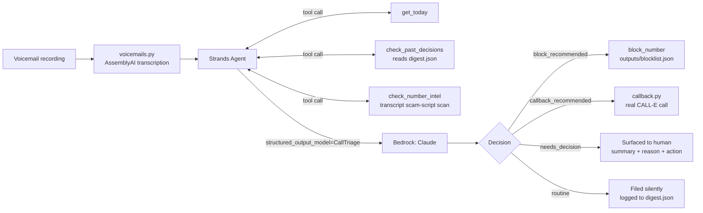

# Callismatic

An agent that listens to the voicemails you'd never otherwise check, decides
what actually needs you, and quietly handles or blocks the rest.

Built on the [Strands Agents SDK](https://strandsagents.com/) (Amazon Bedrock)
for the [Agents for Humans Hackathon](https://agentsforhumans.devpost.com/) —
**Professional Agents** track — with real integrations to
[AssemblyAI](https://www.assemblyai.com/) (voicemail transcription) and
[CALL-E](https://heycall-e.com/) (automatic callbacks), submitted separately
to their respective hackathons as well. See [docs/SUBMISSION.md](docs/SUBMISSION.md)
for the per-hackathon breakdown.

## The problem

Scam and spam calls get bad enough that people and small businesses resort to
blocking all unknown numbers outright. That blocks the scam calls — but it
also blocks the client, the delivery driver, the interviewer, and the
doctor's office, because those are unknown numbers too until someone actually
listens. 80–90% of what gets silently blocked leaves a voicemail nobody ever
checks.

## What it does

Point it at a folder of voicemail recordings. For each one, it:

1. **Transcribes it** — real [AssemblyAI](https://www.assemblyai.com/) speech-to-text,
   not a canned transcript (`src/callismatic/voicemails.py`).
2. **Reasons about it** with tools available mid-thought: `get_today` (to judge
   how stale a callback request has become), `check_past_decisions` (so a
   caller already handled in a prior run isn't re-flagged), and
   `check_number_intel` — a transcript-content scam-script scan, **not** a
   Truecaller or carrier-database lookup (no public API for that exists; see
   [Why not Truecaller](#why-not-a-real-truecaller-integration) below).
3. **Decides** — via Strands' structured-output mode, forced into one schema
   (`src/callismatic/schema.py`): caller category (scam / spam / lead / important
   / routine), a plain-language summary, the concrete facts worth
   remembering, whether a human needs to decide anything, whether it's safe
   to auto-handle with a callback, and whether the number should be blocked.
4. **Acts** — deterministically, outside the model's own reasoning loop (the
   same pattern as logging the decision): blocks the number if it's a
   confirmed scam/spam, places a real callback via
   [CALL-E](https://heycall-e.com/) if the request is simple and automatable
   (`src/callismatic/callback.py`), or surfaces it to the human with full
   context if it genuinely needs a decision. Everything is logged to
   `outputs/digest.json`.

## Architecture



## Setup

```bash
pip install -e .
cp .env.example .env   # then edit BEDROCK_REGION / AWS_PROFILE / BEDROCK_MODEL_ID,
                        # ASSEMBLYAI_API_KEY, and CALLE_API_KEY as needed
```

This project calls Amazon Bedrock, AssemblyAI, and CALL-E, so it needs:
- AWS credentials resolvable by boto3 (`aws configure` or `aws login`, or an
  `AWS_PROFILE` set in `.env`) for the account you want billed, with model
  access enabled for an Anthropic Claude model in the Bedrock console, in the
  region set as `BEDROCK_REGION`.
- An [AssemblyAI](https://www.assemblyai.com/app/account) API key.
- A [CALL-E](https://dashboard.heycall-e.com/account/api-keys) API key (new
  accounts get 20 free calls).

## Running it

```bash
callismatic sample_voicemails
```

or, without installing the console script:

```bash
python -m callismatic.cli sample_voicemails
```

`sample_voicemails/` ships four synthetic voicemails, generated with an
offline TTS engine (`python demo/generate_samples.py` — no extra API key
needed for the *input* audio; the transcription step is still real
AssemblyAI): a gift-card scam script, a new business lead, a routine
appointment confirmation, and an important client matter — chosen to
exercise every branch: block, callback, needs-decision, and filed-silently.

Pass `--no-callbacks` to decide callbacks without actually placing them via
CALL-E, useful for a dry run that doesn't spend call quota.

## Tests

```bash
pytest
```

Tests cover the schema, the scam-script heuristic, the blocklist, and
transcription error-handling with a mocked AssemblyAI client — no live
AWS/AssemblyAI/CALL-E credentials needed to run them.

## Beyond the demo pipeline: opt-in extensions already built

Everything below is off by default -- unset credentials, unchanged behavior. Each is a real,
tested module, not a stub.

- **Correction feedback loop** (`corrections.py`, `check_corrections` tool) — `callismatic
  correct unblock <phone_number>` or `callismatic correct recategorize <file_name> --category
  ...` records a human override; the agent checks `check_corrections` before every decision
  and treats a match as ground truth, so a past misjudgment for that caller isn't repeated.
- **Carrier/community spam-signal layer** (`carrier_intel.py`, `check_carrier_intel` tool) — a
  second, independent signal (line type/carrier via Twilio Lookup) alongside the transcript
  heuristic, never replacing it. Needs `TWILIO_ACCOUNT_SID`/`TWILIO_AUTH_TOKEN`; absent, it
  reports "unavailable" and the transcript heuristic still works alone.
- **Emerging-markets call routing** (`call_router.py`) — a per-country provider registry
  (`PROVIDERS_BY_COUNTRY_CODE`) that `route_call` checks before falling back to CALL-E.
  CALL-E's own docs list many countries, India included, as "International" tier — routed
  through CALL-E's international numbers, which real testing in this project showed can get
  silently filtered by local carriers before the phone ever rings. This module is the
  extension point for a regional SIP/VoIP partner, not a partner integration itself — that
  needs an actual contract, which no code change can substitute for.
- **Multi-channel intake** (`triage_text_message` in `triage.py`) — the same schema, agent,
  and block/callback/record actions, fed an SMS/WhatsApp message body instead of a voicemail
  transcript (no transcription step needed for text). Actually receiving live messages needs
  its own webhook server and provider credentials (Twilio SMS or Meta's WhatsApp Business
  Cloud API) — out of scope here; this is the pipeline side, ready for whatever receives them.
- **Google Sheets CRM sync** (`crm_sheets.py`) — appends every triaged result as a row,
  strictly opt-in and best-effort: a sync failure is logged, never raised, so a CRM outage
  can't break triage. Needs `GOOGLE_SERVICE_ACCOUNT_FILE` (a service account key) and
  `GOOGLE_SHEET_ID`, with the sheet shared to that service account's own email.
- **Weekly trust digest** (`digest_report.py`, `callismatic digest`) — since the whole design
  is the agent acting quietly on your behalf, this is the audit trail: "N blocked, N
  recommended for callback, N still need your decision" over the last N days. Delivery is
  `stdout`/`file` today (no credential needed); a WhatsApp/SMS/email channel is a small
  addition once one is chosen, not a redesign.

## Why not a real Truecaller integration

Truecaller has no public developer API for reverse number lookup or call
blocking — it's a closed consumer product, not something a third-party
project can integrate with. `check_number_intel` does honest, real work
instead: it scans the transcript itself for concrete scam-script markers
(gift-card/wire/crypto payment requests, urgency or legal-threat pressure,
government-agency impersonation) as a heuristic signal for the agent to
weigh — never a fabricated "Truecaller lookup."

## What's out of scope for this pass

- No live phone line — voicemails come from a local folder, not a real
  inbound number. A real deployment would wire this to Twilio's recording
  webhooks; the caller number instead comes from the sample file's name
  (`caller_number_from_filename` in `src/callismatic/triage.py`).
- No folder-watching daemon — this is a batch run, not a background service.
- The scam-script check is a content heuristic, not a carrier-verified
  signal — see above.

## License

MIT — see [LICENSE](LICENSE).
