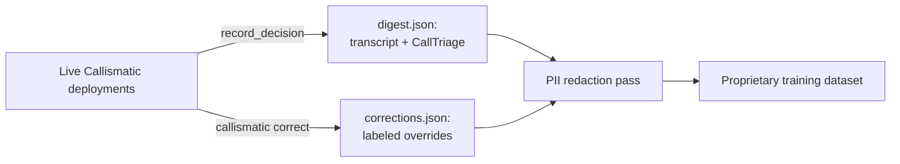
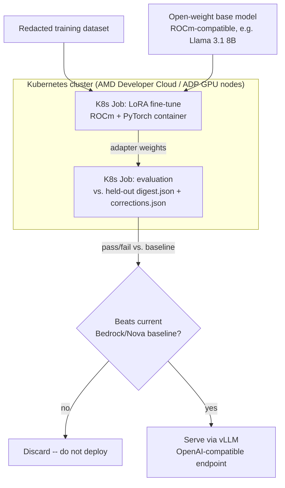

# Proprietary Triage Model: Kubernetes + AMD Training Architecture

Target: [AMD Developer Hackathon: ACT III](https://lablab.ai/event/amd-developer-hackathon-act-iii)
(theme: "Build AI agents and high-performance AI applications on AMD GPUs in the cloud,"
online build phase Oct 12–18, 2026, requires an AMD AI Developer Program (ADP) account).

**What this document is**: the target architecture for training a proprietary, task-specific
model for Callismatic's triage decisions, to be built as a first real slice during ACT III's
build window. **What this document is not**: a trained model, or a claim that AMD compute has
been provisioned yet. No fine-tuning has happened. This is a design, scoped honestly to what's
achievable in a one-week hackathon build window, not a finished product.

## Why this is genuinely proprietary, not a wrapper around someone else's model

Callismatic already collects the exact data a fine-tune needs, as a side effect of features
built for other reasons:

- `outputs/digest.json` — every triage decision, with the full transcript and the structured
  `CallTriage` output that produced it (`triage.py`, `record_decision`).
- `outputs/corrections.json` — every time a human overrode the agent
  (`corrections.py`/`check_corrections`, built for the correction feedback loop, see
  README's "Beyond the demo pipeline" section). Each entry is already a labeled
  `(input, model's decision, human's correction, reason)` tuple — the exact shape supervised
  fine-tuning or preference-tuning data needs, not something that has to be constructed
  separately.

No competitor training on generic call-center or customer-service transcripts has this: the
specific decision boundary between "block," "auto-callback," "needs a human," and "stay
silent," corrected by the specific human who owns the outcome. That's the proprietary asset —
the data pipeline, not a novel model architecture.

## Data pipeline

`digest.json`/`corrections.json` entries contain real names, phone numbers, and companies —
before anything leaves a deployment for centralized training, a redaction pass is mandatory,
not optional (consistent with this program's standing PII-handling discipline). This redaction
step is real, near-term work, not a training-time detail to defer.

## Training architecture

- **Base model**: a small, open-weight model (e.g. Llama 3.1 8B class, not a frontier-scale
  model) — this is a narrow classification-shaped task (5 categories, a handful of boolean
  flags, short structured output), not open-ended generation, so a large base model is the
  wrong tool, not a stronger one.
- **Method**: LoRA/QLoRA, not full fine-tuning — cheaper, faster, and appropriate for how
  narrow the target behavior is relative to the base model's general capability.
- **Why Kubernetes specifically, not a bare VM**: reproducibility (the training job is a spec
  in version control, not a manually-run script on someone's machine), the ability to run
  parallel hyperparameter sweeps across GPU nodes, and a real path to the thing that actually
  matters long-term — periodic retraining triggered automatically as `corrections.json` grows,
  not a one-off training run.
- **No deployment without measured evidence**: the evaluation job compares the fine-tuned
  model's accuracy against Bedrock/Nova's own accuracy on the same held-out decisions before
  anything is considered for production — the same evidence-discipline this whole project has
  followed (real timed runs, real error messages, no claimed result without a command that
  produced it).

## How it plugs back into the live agent (confirmed against Strands' real API, not assumed)

Strands' `Agent` takes any `Model` — an abstract base class (`strands.models.Model`) that
`BedrockModel` itself implements (`stream`, `structured_output`, `count_tokens`, etc.). A
served fine-tuned model behind an OpenAI-compatible endpoint (vLLM) is a straightforward
second implementation of that same interface — this is a supported extension point, not a
workaround.

Better still, Strands ships `ModelRouter`, `RoutingStrategy`, and `FallbackStrategy` natively
(`strands.models.routing`) — built for exactly this shape of problem: try the proprietary
fine-tuned model first (cheaper and faster once trained, tuned to this exact decision
boundary), and fall back to Bedrock/Nova automatically if the AMD-hosted endpoint is
unavailable. `models.py`'s `get_model()` becomes a `ModelRouter` wrapping both, not a
replacement of the existing Bedrock path — Bedrock/Nova stays as the safety net, not something
this removes.

## Phased roadmap — honest about what's real today vs. future

- **Phase 0 (done today)**: the data collection mechanism already exists and is live —
  `digest.json` and `corrections.json` are being written by the current pipeline regardless of
  whether training ever happens, since they were built for the correction feedback loop.
- **Phase 1 (the actual ACT III build, Oct 12–18)**: provision AMD Developer Cloud/ADP access,
  build the redaction pass, containerize a LoRA fine-tuning job for a ROCm-compatible base
  model, run it as a real Kubernetes Job against a necessarily small seed dataset (real
  production data won't have accumulated at scale yet), and run the evaluation job against
  whatever real `digest.json`/`corrections.json` entries exist by then. A real, working,
  small-scale proof of concept -- not a production-grade model, and said so explicitly in
  that submission.
- **Phase 2 (post-hackathon)**: accumulate real data across actual deployments, wire in the
  `ModelRouter`/`FallbackStrategy` in the live agent, retrain periodically.
- **Phase 3 (later)**: a continuous retraining pipeline where new corrections automatically
  trigger a retraining Job, closing the loop between "a human corrected the agent" and "the
  agent's own weights reflect it," not just its prompt-time context (`check_corrections`
  already does the latter today, in-context, for free).

## What this is not, stated plainly

No AMD compute has been provisioned. No training job has run. No fine-tuned model exists. The
production Callismatic agent runs on Amazon Bedrock/Nova today, unchanged by this document.
This is the architecture Phase 1 above would build a first real slice of during ACT III's
actual build window -- written now so that build starts from a design, not a blank page.
